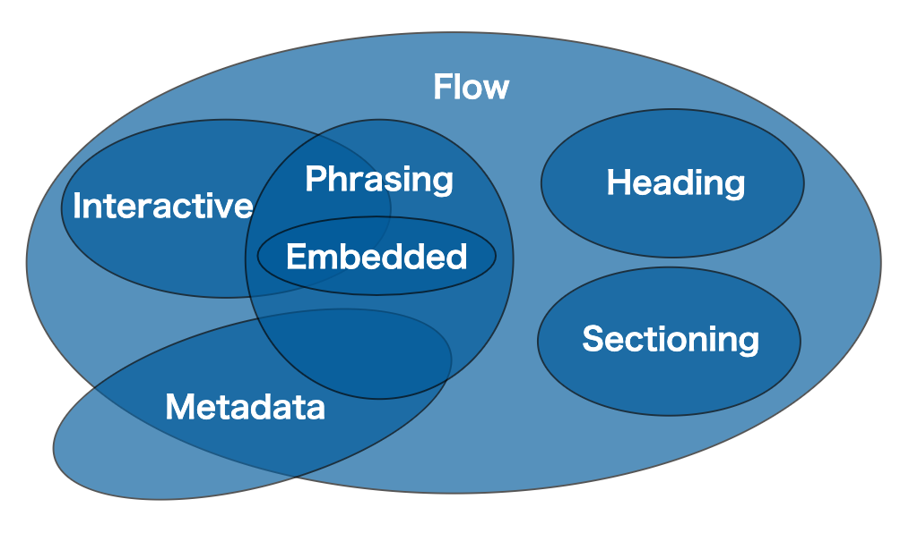

# Index
- [Index](#index)
- [Basic HTML Template](#basic-html-template)
- [Contents Model and Category](#contents-model-and-category)
- [Tags](#tags)
  - [br](#br)
  - [h*](#h)
  - [p](#p)
  - [div](#div)
  - [span](#span)
  - [a](#a)
  - [img](#img)
  - [ul, ol](#ul-ol)
  - [dl](#dl)
  - [table](#table)
- [Form Tags](#form-tags)
  - [Text](#text)
  - [Password](#password)
  - [Textarea](#textarea)
  - [Radio Button](#radio-button)
  - [Check Box](#check-box)
  - [Dropdown List](#dropdown-list)
  - [Submit](#submit)
  - [Button](#button)
  - [Reset](#reset)
  - [Button Tag](#button-tag)
  - [Hidden](#hidden)
- [Special Characters](#special-characters)
- [Document Structure Tags](#document-structure-tags)
  - [header](#header)
  - [footer](#footer)
  - [article](#article)

# Basic HTML Template
```html
<!DOCTYPE html>
<html lang="ja">
<head>
  <meta charset="utf-8">
  <title>Page Title</title>
</head>
<body>
  <!-- This is a comment -->
  Hello World
</body>
</html>
```

# Contents Model and Category
- HTML <= 4.01
  - Block and Inline Element
- HTML >= 5
  - Category: Each HTML element falls into zero or more categories
  - Contents Model:
  

# Tags
## br
Line BReak tag
```html
This is line 1<br>
This is line 2
```

## h*
Heading tag
```html
<h1>This is a heading 1</h1>
<h2>This is a heading 2</h2>
<h3>This is a heading 3</h3>
<h4>This is a heading 4</h4>
<h5>This is a heading 5</h5>
<h6>This is a heading 6</h6>
```

## p
Paragraph tag
```html
<p>This is a paragraph</p>
```

## div
DIVision tag
```html
<div>
    This is a content of div
</div>
```

## span
SPAN tag
```html
<span>Spam</span>
```

## a
Anchor tag
```html
<a href="www.url.com">Click here!</a>
```

## img
IMaGe tag
```html

```

## ul, ol
Unordered List and Ordered List
```html
<ul>
    <li>List element 1</li>
    <li>List element 2</li>
    <li>List element 3</li>
</ul>

<ol>
    <li>List element 1</li>
    <li>List element 2</li>
    <li>List element 3</li>
</ol>
```

## dl
Description List
```html
<dl>
    <dt>Definition Term</dt>
    <dd>Definition Description</dd>
</dl>
```

## table
TABLE tag
```html
<table>
    <tr>
        <th>Table Heading</th>
        <th>Table Heading</th>
    </tr>
    <tr>
        <td>Table Data</td>
        <td>Table Data</td>
    </tr>
    <tr>
        <td>Table Data</td>
        <td>Table Data</td>
    </tr>
</table>
```

# Form Tags
## Text
```html
<input type="text" name="username" value="your user name">
```
<input type="text" name="username" value="your user name">

## Password
```html
<input type="password" name="password">
```
<input type="password" name="password">

## Textarea
```html
<textarea name="impression" id="textarea" cols="30" rows="10"></textarea>
```
<textarea name="impression" id="textarea" cols="30" rows="10"></textarea>

## Radio Button
```html
<form>
    <input type="radio" name="color" value="red" checked>Red
    <input type="radio" name="color" value="green">Green
    <input type="radio" name="color" value="blue">Blue
</form>
```
<form>
    <input type="radio" name="color" value="red" checked>Red
    <input type="radio" name="color" value="green">Green
    <input type="radio" name="color" value="blue">Blue
</form>

## Check Box
```html
<form>
    <input type="checkbox" name="interest" value="sports" checked>Sports
    <input type="checkbox" name="interest" value="movie">Movie
    <input type="checkbox" name="interest" value="reading">Reading
</form>
```
<form>
    <input type="checkbox" name="interest" value="sports" checked>Sports
    <input type="checkbox" name="interest" value="movie">Movie
    <input type="checkbox" name="interest" value="reading">Reading
</form>

## Dropdown List
```html
<form>
    <select name="week">
        <option value="1">Sunday</option>
        <option value="2">Monday</option>
        <option value="3">Tuesday</option>
        <option value="4">Wednesday</option>
        <option value="5">Thursday</option>
        <option value="6">Friday</option>
        <option value="7">Saturday</option>
    </select>
</form>
```
<form>
    <select name="week">
        <option value="1">Sunday</option>
        <option value="2">Monday</option>
        <option value="3">Tuesday</option>
        <option value="4">Wednesday</option>
        <option value="5">Thursday</option>
        <option value="6">Friday</option>
        <option value="7">Saturday</option>
    </select>
</form>

## Submit
```html
<form action="login">
    <input type="submit" name="login" value="Login">
</form>
```
<form action="login">
    <input type="submit" name="login" value="Login">
</form>

## Button
```html
<form>
    <input type="button" value="Execute" onclick="alert('test')">
</form>
```
<form>
    <input type="button" value="Execute" onclick="alert('test')">
</form>

## Reset
```html
<form>
    <input type="text" value="Initial value">
    <input type="reset" value="Reset">
</form>
```
<form>
    <input type="text" value="Initial value">
    <input type="reset" value="Reset">
</form>

## Button Tag
```html
<form id="form1">
    <input type="text">
</form>

<button type="submit" form="form1">Submit</button>
```
<form id="form1">
    <input type="text">
</form>

<button type="submit" form="form1">Submit</button>

## Hidden
```html
<form>
    <input type="hidden" name="hyde" value="This is hidden text">
    <button type="submit">Submit</button>
</form>
```
<form>
    <input type="hidden" name="hyde" value="This is hidden text">
    <button type="submit">Submit</button>
</form>

# Special Characters
| Characters | Special Characters |
| :--------- | :----------------- |
| (Space)    | `&nbsp;`           |
| <          | `&lt;`             |
| >          | `&gt;`             |
| ¥          | `&yen;`            |
| &copy;     | `&copy;`           |

etc.

# Document Structure Tags
## header
```html
<header>
    This is header
</header>
```

## footer
```html
<footer>
    This is footer
</footer>
```

## article
```html
<article>
    This is article
</article>
```